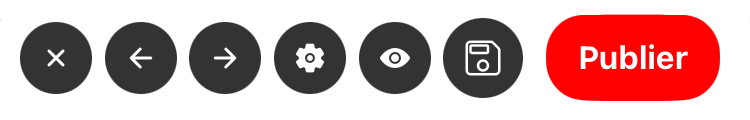

⚠️ The code has not been refactored yet; it may be a bit raw and unpolished for now.⚠️

# CanvasMemories

**CanvasMemories** is a prototype inspired by features such as Instagram Stories or Unfold templates. The goal is to provide a library that enables the integration of an easy-to-use editor, easily integrable for Expo users.

<table>
  <tr>
    <th style="text-align: center;">Preview of the Editor</th>
    <th style="text-align: center;">Template of the Editor</th>
  </tr>
  <tr>
    <td style="text-align: center;">
      
    </td>
    <td style="text-align: center;">
      
    </td>
  </tr>
</table>

## Project Objective

Create a library that offers an intuitive editor for designing interactive stories or visual experiences. The project is designed for seamless integration into Expo applications.

## Key Features

- **Customizable Templates**: Easily select and load predefined templates.
- **Drag-and-Drop**: Move and resize elements freely on the canvas.
- **Undo/Redo**: Seamlessly navigate through your design history.
- **Preview Mode**: See your design without guides or helpers.

### Bottom Bar

- **Add Text**  
  Allows inserting editable text directly onto the canvas.
- **Add Sticker**  
  Enables adding stickers (images) to the canvas.
- **Add Background Image**  
  Possibility to set an image as a background.
- **Basic Filters**  
  Apply simple filters that overlay on the image.
- **Template**  
  One preconfigured template is available for a quick start.

### Top Bar

- **Close Button**  
  Allows closing or going back from the editor.
- **Previous and Next Action Buttons**  
  Navigate through the modification history (Undo/Redo).
- **Advanced Mode Button**  
  Activates an advanced mode that allows resizing text length and viewing element sizes.
- **Preview Button**  
  Displays the current result without guides or helpers to see the final output.
- **"Publish" Action Button**  
  Triggers the action to publish the final result.

## Element Characteristics

- **Element States**  
  Some elements can be `locked`, meaning they cannot be moved or altered, particularly in templates.

- **Resizing and Rotation**  
  Elements (text, stickers, images) can be resized and rotated by the user for precise positioning and adjustment.

## Roadmap
- (v1) : all basics features
- (v1) : support french🇫🇷 & english 🏴󠁧󠁢󠁥󠁮󠁧󠁿 languages
- (v1) : add stickers & template in a folder
- (v1) : npm package
- (v1) : refacto & code

- (v2) Support for video elements.
- (v2) Advanced filters and blending modes.
- (v2) Multi-layer editing.
- (v2) Export to multiple formats.

---

CanvasMemories aims to be a comprehensive solution for easily creating and editing stories or visual content, with smooth integration into Expo projects. This documentation briefly describes its features and architecture to guide users in getting started with the library.
